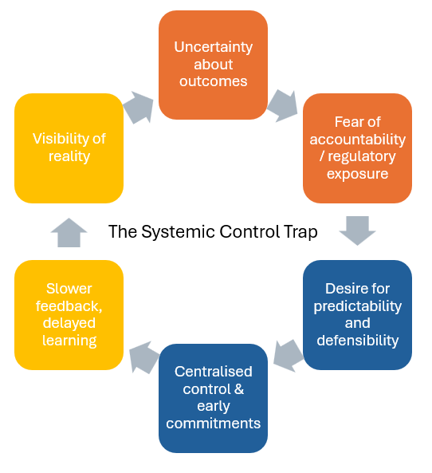

# Psychological Safety at the Executive Level

Psychological safety is commonly discussed as a team-level concern — the ability for individuals to speak up, admit uncertainty, and challenge ideas without fear of punishment or humiliation.

In complex, regulated organisations, this framing is incomplete.

Some of the most consequential fear — and the least acknowledged lack of psychological safety — exists **at the executive level**.

This essay explores why excessive control is often a rational response to executive fear, and how learning-governed systems offer a more effective and humane way to manage risk.

***

### Fear Looks Different at the Top

Executives operate under conditions that differ fundamentally from those of teams:

* personal accountability for organisational outcomes
* regulatory exposure and retrospective judgement
* asymmetric risk (large downside, limited upside)
* unclear thresholds for what counts as “reasonable”
* responsibility without full visibility

From this vantage point, uncertainty does not feel like an abstract property of complex systems.\
It feels like **personal exposure**.

When leaders ask for:

* earlier commitments
* more detailed plans
* tighter controls
* additional approval layers

they are rarely seeking power for its own sake.

They are seeking **protection**.

***

### Excessive Control as a Coping Strategy

In the absence of better mechanisms, control becomes a coping strategy for fear.

Control appears to offer:

* predictability
* auditability
* defensibility
* proof of diligence

Even when leaders understand intellectually that:

* plans are speculative
* estimates are fragile
* certainty is illusory

the system often offers them **no safer alternative**.

In such environments, _not_ exerting control can feel reckless.

From within those constraints, excessive control is not irrational.\
It is the safest option available.

***

### The Systemic Trap

This creates a self-reinforcing loop:

1. **Uncertainty is experienced as risk**
2. Risk is addressed through control
3. Control slows learning and feedback
4. Reduced learning increases uncertainty
5. Uncertainty reinforces fear

The organisation becomes highly managed and poorly informed at the same time.

Learning is talked about.\
But control governs behaviour.

***

<figure><figcaption></figcaption></figure>

***

### Psychological Safety Is Not Only a Cultural Issue

This is why psychological safety cannot be reduced to mindset or leadership style.

At the executive level, psychological safety is **structural**.

Leaders lack safety when:

* being wrong carries disproportionate consequence
* uncertainty is penalised rather than explored
* learning invalidates prior commitments publicly
* governance demands certainty before evidence exists

No amount of coaching can compensate for a system that makes caution the only rational choice.

***

### Learning Systems as Risk Mitigation

This is where EOM reframes the problem.

Learning-governed systems reduce **perceived risk** by changing its shape.

They do this by:

* staging commitments incrementally
* limiting blast radius through reversibility
* separating exploration from guarantee
* treating evidence as protection, not exposure
* making decision updates normal rather than exceptional

In such systems, leaders are not asked to “be brave”.

They are given **safer ways to decide**.

***

<figure><figcaption></figcaption></figure>

***

### Executive Psychological Safety Comes from Design

Executives experience psychological safety when:

* they can revise direction without reputational damage
* admitting uncertainty is treated as diligence
* learning reduces future exposure rather than increasing scrutiny
* governance forums sense and adapt rather than approve and punish
* accountability is shared across evidence, not concentrated on prediction

When these conditions hold, control no longer feels necessary.

Not because leaders changed,\
but because the system did.

***

### A Reframing of Control

From this perspective, excessive control is not a leadership failure.

It is a **diagnostic signal**.

It tells us:

* where fear is concentrated
* where risk is being displaced
* where learning is structurally unsafe

Treating control as a moral failing misses the opportunity.

Treating it as system feedback enables change.

***

### Implications for Leaders

The most important question for leaders is not:

> “How do we loosen control?”

But:

> **“What conditions would make control unnecessary?”**

When learning governs behaviour,\
when commitments are earned rather than forced,\
and when being wrong is survivable,

psychological safety emerges —\
not just for teams,\
but for those carrying the greatest risk.

***

### In Summary

Excessive control is often the rational response of leaders operating without psychological safety.

Learning systems are not a threat to governance or accountability.\
They are a **more effective strategy for risk management** in uncertain environments.

When systems make learning safer than prediction,\
control recedes naturally.

Not because leaders let go —\
but because they no longer need to hold on.
