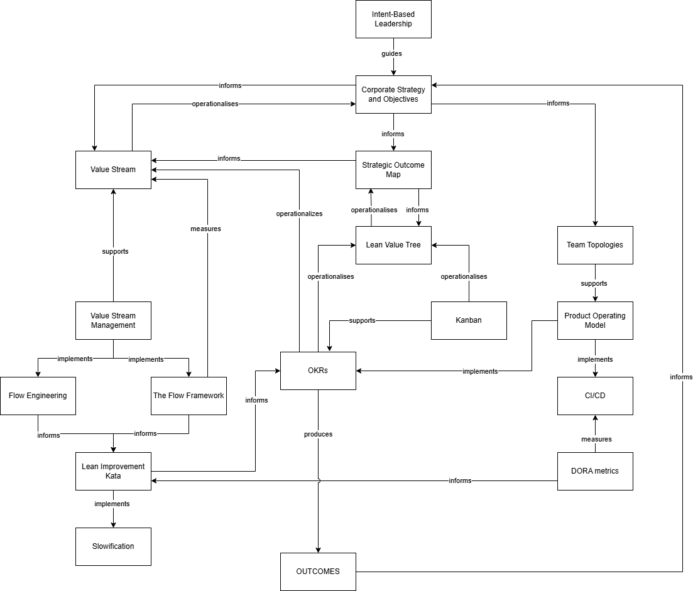

# The Emergent OS Component Relationship Model

The following diagram shows how key EmergentOS concepts relate to one another.

It is **not an architecture, process, or implementation model**. It exists to make system-level relationships visible — particularly the conditions under which commonly used practices succeed or fail.

Read this as **a relationship model**, not a plan.

[Reading the EmergentOS Component Relationship Model](https://app.gitbook.com/s/abU988grMBS3MbFi8ZSB/reading-the-emergentos-component-relationship-model)
