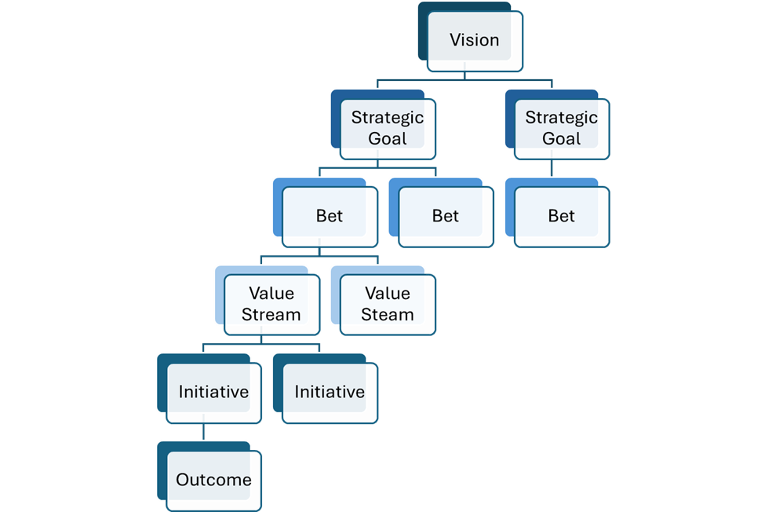

# Playbook: Adaptive Funding

## Status

Illustrative practice guide\
Not mandatory. Not prescriptive. Context-sensitive.

***

## Purpose of Adaptive Funding in EmergentOS

In EmergentOS, funding exists to **enable learning before commitment**.

It is not:

* a promise of delivery
* a proxy for confidence
* a reward for optimism
* a control mechanism

EOS uses adaptive funding to:

* reduce investment risk through learning
* prevent sunk-cost escalation
* align investment with outcomes
* reallocate resources based on evidence
* preserve strategic optionality

Funding is treated as a **dynamic decision**, not a one-time allocation.

***


**Lineage note**

The concepts of metered funding and learning-driven investment draw from:

* _Lean Startup_ — Eric Ries\
  (metered funding, innovation accounting, validated learning)
* _EDGE_ — Highsmith et al.\
  (incremental investment, value-based governance)
* _SOONER SAFER HAPPIER_ — Jonathan Smart\
  (BVSSH model, outcome-oriented funding, investment horizons)

EmergentOS synthesizes these ideas and applies them under a **learning-first, flow-aware, non-deterministic operating model**.\
EOS explicitly rejects using funding as a delivery contract or performance control.

[References](https://app.gitbook.com/s/oCIDNaq6Gp7xkyOJCltO/literature)


***

## The Problem Traditional Funding Models Create

Traditional funding models assume:

* scope can be forecast reliably
* value will emerge if delivery completes
* deviation signals failure
* certainty increases with time

In complex environments, these assumptions fail.

Common consequences include:

* early over-commitment
* late discovery of invalid assumptions
* defensive status reporting
* escalation driven by sunk cost
* inability to stop low-value work
* portfolios clogged with “almost done” initiatives

Adaptive funding exists to **break this pattern safely**.

***

## Core Assumptions (Required for Adaptive Funding to Work)

Adaptive funding in EOS assumes:

1. Value is uncertain at the start
2. Learning reduces risk faster than analysis
3. Commitment should increase as uncertainty decreases
4. Stopping work is a valid and valuable outcome
5. Funding decisions must evolve with evidence

If these assumptions are rejected, funding becomes theater.

***

## Funding as a Series of Learning Bets

In EmergentOS, funding is framed as a **portfolio of bets**, not projects.

Each bet includes:

* a strategic intent
* an outcome hypothesis
* explicit assumptions
* a bounded investment
* a learning expectation

The central question is not:

> “How much will this cost to deliver?”

But:

> “What must we learn to justify the next increment?”

***

## Lean Value Trees as the Structural Backbone for Adaptive Funding

EmergentOS uses **Lean Value Trees (LVTs)** to make strategy, investment, and learning **explicit, visual, and navigable**.

LVTs provide the **shared map** that connects:

* strategic intent
* hypotheses and bets
* value streams
* funding decisions
* outcomes and evidence

They intentionally align with other visual practices in EOS (e.g. Kanban, Portfolio Kanban, flow visualisation) to support transparency and sensemaking.

***

## Structure of a Lean Value Tree (LVT)

An LVT in EmergentOS is composed of the following layers:

### 1. Vision (Optional Top Layer)

The long-term aspiration or purpose of the organization.

* Directional, not measurable
* Stable over time
* Provides context rather than control

***

### 2. Strategic Themes (or Strategic Goals)

High-level objectives that define the organization’s direction.

* Often expressed as enterprise or portfolio-level OKRs
* Outcome-oriented rather than solution-oriented
* Reviewed and refined periodically

These themes answer:

> _What matters most right now?_

***

### 3. Bets

**Bets are hypotheses about where to invest** in order to achieve the strategic themes.

* Bets are _not initiatives_
* Bets are strategic experiments
* Each bet assumes:

> _If we invest here, we expect to move the outcome in this direction_

Each bet includes:

* a clear hypothesis
* expected outcomes
* success and failure criteria
* explicit uncertainty

Bets are the **primary unit of adaptive funding** in EOS.

***

### 4. Value Streams

Value Streams represent the **structural pathways** through which value is delivered to customers and the business.

* They are relatively stable
* They organize teams and flow
* They persist beyond individual bets

In EmergentOS:

* **Bets may span one or more value streams**
* Value streams provide capacity and flow context
* Funding is not allocated _to_ value streams blindly, but _through_ them in service of bets

This distinction prevents long-lived structures from becoming proxies for strategy.

***

### 5. Initiatives / Epics

Initiatives are **expressions of a bet within one or more value streams**.

* They are intentionally provisional
* They emerge as learning progresses
* They may be split, replaced, or stopped

Initiatives exist to:

* test hypotheses
* generate evidence
* move outcomes

They are not promises of scope.

***

### 6. Hypotheses and Outcomes

Each initiative is tied to:

* explicit hypotheses
* measurable outcomes
* learning expectations

These outcomes are validated through:

* delivery
* discovery
* telemetry
* flow and business metrics

This layer closes the loop between **investment and evidence**.

***

***

## How Bets, Value Streams, and Funding Interact

In EmergentOS:

* **Funding is allocated to bets**, not projects
* **Bets cut across value streams**, reflecting how customers experience value
* **Value streams provide the delivery and learning capacity**
* **Investment increases only as uncertainty decreases**

This allows organizations to:

* pursue strategic intent without reorganizing constantly
* avoid “value stream equals strategy” thinking
* reallocate funding without destabilizing teams
* maintain flow while adapting direction

***

## Concrete Example: Applying a Bet Across Value Streams

### Strategic Theme

Improve customer retention in the first 90 days.

***

### Bet

_If we reduce early friction and improve perceived value in the first month, customer retention will increase._

***

### Value Streams Involved

* Customer Onboarding
* Core Product Experience
* Customer Support

The bet spans multiple streams because the outcome spans the customer journey.

***

### Initiatives (Emergent, Not Committed)

* Onboarding simplification experiments
* Early value feature experiments
* Proactive support interventions

Each initiative:

* is small and reversible
* contributes evidence toward the bet
* may live in a different value stream

***

### Funding Implications

* Initial funding is modest and time-boxed
* Evidence is reviewed at the bet level
* Funding increases only if outcomes show signal
* Initiatives are stopped freely without “failure”

The bet—not the initiatives—remains the focal point of governance.

***

## Anti-Pattern: Treating Value Streams as Funding Buckets

A common failure mode is allocating fixed budgets per value stream and expecting outcomes to emerge.

**Why this fails**

* Incentivizes local optimization
* Decouples investment from strategy
* Encourages output over outcome
* Makes stopping work politically difficult

EmergentOS uses LVTs specifically to avoid this pattern.

***

## Why Lean Value Trees Matter in Adaptive Funding

Lean Value Trees allow EmergentOS to:

* visualise strategy-to-outcome traceability
* make investment intent explicit
* separate **structure (value streams)** from **strategy (bets)**
* support learning-driven funding decisions
* enable governance through evidence rather than status

Without an LVT, adaptive funding quickly collapses back into project or budget-based control.

With it, funding becomes a **strategic learning system** rather than a financial one.

***

## Metered Investment: How Commitment Evolves

Investment increases in **deliberate tranches**, each justified by learning.

Typical progression:

1. **Exploration** – small investment to test assumptions
2. **Validation** – increased funding once outcomes show signal
3. **Scaling** – sustained investment after evidence accumulates
4. **Continuation, Pivot, or Stop** – based on results

The specific stages are not fixed.\
The principle is incremental, reversible commitment.

***

## Concrete Example 1: New Product Capability

### Context

An organization believes a new self-service capability will drive growth.

Uncertainty is high:

* demand unclear
* pricing unknown
* technical feasibility unproven

***

### EOS-Aligned Outcome Framing

**Who / Does What / By How Much**

* **Target customers** adopt self-service features, increasing usage **from 10% to 30%**
* **Time to task completion** reduced **by 40%**
* **Support requests for the capability** reduced **by 25%**

***

### Initial Funding (Exploration)

**Purpose**

* Validate demand and feasibility

**Funding Characteristics**

* Small, time-boxed
* Focused on discovery and experimentation
* Explicit learning goals

**Learning Signals**

* Evidence of willingness to use/pay
* Feasibility constraints identified
* Assumptions validated or invalidated

***

### EOS-Aligned Decision

* If learning is strong → increase investment
* If learning is weak → pivot or stop
* If evidence is ambiguous → extend learning deliberately

Stopping at this stage is success, not failure.

***

### Anti-Pattern: Full Funding Upfront

**Approach**

* Fund full delivery based on business case
* Lock scope and timeline
* Defer learning until late

**Why this fails**

* Risk is back-loaded
* Reversal becomes politically difficult
* Learning arrives too late to matter

***

## Concrete Example 2: Portfolio-Level Investment Overload

### Context

Leadership believes “everything is critical.”

20+ initiatives are active simultaneously.

***

### EOS-Aligned Outcome Framing

* **Active initiatives** reduced **from 20 to under 12**
* **Time to reallocate funding** reduced **from quarterly to monthly**
* **Initiatives stopped or paused** based on evidence increase quarter over quarter

***

### Flow & Investment Evidence

* High portfolio WIP
* Many initiatives with no recent learning
* Funding locked despite lack of progress

***

### EOS-Aligned Intervention

* Visualize investments as a flow
* Introduce WIP limits at initiative level
* Require evidence checkpoints before further funding

Funding decisions shift from **allocation** to **flow management**.

***

### Anti-Pattern: Annual Re-Baselining

**Approach**

* Re-approve everything once a year
* Assume sunk cost equals progress

**Why this fails**

* Slow response to learning
* Escalation of commitment
* Strategic drift persists

***

## How Adaptive Funding Interacts with OKRs

In EmergentOS:

* OKRs define intended outcomes
* Funding follows validated progress toward those outcomes

Funding reviews ask:

* What have we learned?
* What assumptions changed?
* What outcome signals are emerging?
* What does this justify next?

OKRs do not guarantee funding.\
Funding responds to evidence, not intent.

***

## How Adaptive Funding Interacts with Flow Metrics

Flow metrics reveal:

* stalled investments
* delayed decisions
* over-commitment
* portfolio bottlenecks

Funding acts on these signals by:

* pausing work
* re-sequencing bets
* reallocating capital
* reducing WIP

Flow tells you **where** to look.\
Funding decides **what to change**.

***

## Governance as Investment Coaching

In EOS, funding governance is developmental.

Leaders do not ask:

> “Are you on track?”

They ask:

> “What have we learned that changes our confidence?”

Coaching focuses on:

* clarity of hypotheses
* quality of evidence
* integrity of decisions
* responsiveness to learning

***

## Common Misuses of Adaptive Funding

### 1. Metered Funding Without Empowerment

**Why:**\
Fear of decentralization.

**Result:**\
Delayed decisions, frustration, slow learning.

***

### 2. Learning Theatre

**Why:**\
Desire to justify continued funding.

**Result:**\
Evidence selection bias.

***

### 3. Inconsistent Decision Criteria

**Why:**\
Ambiguous governance signals.

**Result:**\
Loss of trust.

***

### 4. Funding Without Stop Mechanisms

**Why:**\
Cultural stigma around stopping.

**Result:**\
Portfolio congestion.

***

## Signals Adaptive Funding Is Working

Adaptive funding is healthy when:

* decisions change without blame
* investments stop early and often
* funding reviews focus on evidence
* learning velocity increases
* portfolio WIP decreases
* strategic intent remains clear

***

## Signals Adaptive Funding Is Doing Harm

Adaptive funding is harmful when:

* it becomes micromanagement
* teams fear losing funding
* learning is hidden
* decisions are delayed
* funding gates replace trust

In these cases, governance—not funding—needs attention.

***

## Final Sanity Check

Before increasing funding, ask:

* _What uncertainty was reduced?_
* _What evidence supports confidence?_
* _What would cause us to stop?_
* _Is this decision reversible later?_

If these cannot be answered, delay commitment.

***

## Closing Note

Adaptive funding does not reduce ambition.

It reduces **unexamined confidence**.

EmergentOS treats funding as a learning system\
because the safest way to invest in uncertainty\
is to let evidence—not optimism—decide.
