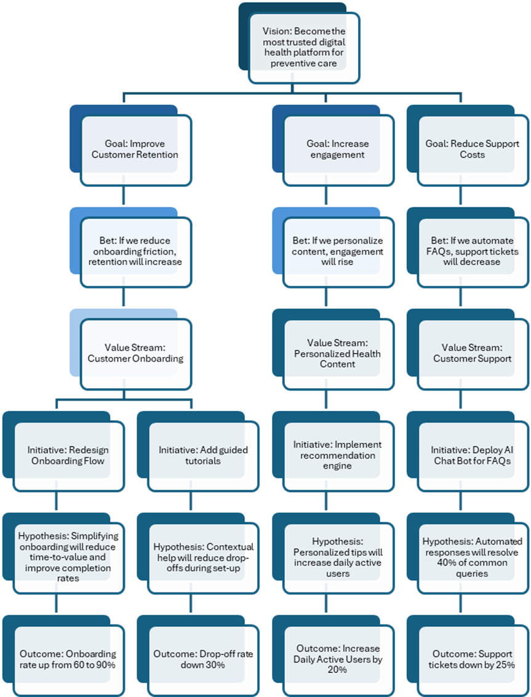

# Playbook: Strategic Alignment (LVTs, OKRs, Flow)

## Status

Illustrative practice guide\
Not mandatory. Not prescriptive. Context-sensitive.

***

## Purpose of Strategic Alignment in EmergentOS

In EmergentOS, strategic alignment is not achieved through cascading plans or centralized control.

It is achieved through:

* shared intent
* visible hypotheses
* outcome-oriented goals
* transparent flow of work

This playbook describes how **Lean Value Trees (LVTs)**, **OKRs**, and **Portfolio Kanban** work together to connect organizational strategy to down-level teams **without reverting to deterministic planning**.

***


**Lineage note**

Lean Value Trees were introduced by Linda Luu, Jim Highsmith, and Dave Robinson as part of Thoughtworks’ work on value-driven transformation, and formalized in _EDGE_.

Their intent was to provide a lightweight, hypothesis-driven approach to portfolio governance that connects strategy to execution while preserving adaptability.

EmergentOS adopts Lean Value Trees as a **strategic alignment mechanism**, and integrates them with OKRs and flow-based visualization to form a continuous alignment loop.

[References](https://app.gitbook.com/s/oCIDNaq6Gp7xkyOJCltO/literature)


***

## The Strategic Alignment Problem EOS Is Solving

Most organizations struggle to align strategy and execution because:

* strategy is abstract and disconnected from delivery
* priorities are communicated as plans, not intent
* teams receive work without understanding why it matters
* visibility focuses on status, not value
* alignment relies on compliance rather than clarity

Symptoms include:

* locally efficient teams delivering low-impact work
* frequent priority thrashing
* “everything is important” portfolios
* long feedback loops between strategy and outcomes

EOS addresses this by replacing **cascaded commitments** with **shared, visual intent**.

***

## The Role of Lean Value Trees in EmergentOS

Lean Value Trees are the **primary strategic alignment artefact** in EOS.

They provide a **visual map** that connects:

* strategic intent
* investment hypotheses
* structural value streams
* delivery initiatives
* outcomes and evidence

An LVT answers the question:

> _How does the work we are funding move us toward the outcomes we care about?_

***

## Structure of a Lean Value Tree (Recap)

### 1. Vision (Optional)

* Long-term aspiration or purpose
* Directional, not measurable
* Provides context, not constraints

***

### 2. Strategic Themes (or Strategic Goals)

* High-level objectives or portfolio OKRs
* Define what matters most now
* Outcome-oriented rather than solution-oriented

These themes anchor alignment across the organization.

***

### 3. Bets

Bets are **hypotheses about where to invest** in order to achieve the strategic themes.

* Bets assume uncertainty
* Bets define expected outcomes
* Bets are reviewed through evidence
* Bets are the primary unit of prioritization and funding

A bet states:

> _If we invest in this area, we expect to see this outcome._

***

### 4. Value Streams

Value streams represent the **structural flow of value** to customers.

* Relatively stable
* Organize teams and flow
* Provide delivery capacity

In EOS:

* Bets may span multiple value streams
* Value streams do not own strategy
* Strategy flows _through_ value streams via bets

***

### 5. Initiatives / Epics

Initiatives are **temporary expressions of bets** within value streams.

* They are experiments, not promises
* They are expected to change
* They are stopped freely when learning dictates

***

### 6. Hypotheses and Outcomes

Each initiative includes:

* explicit hypotheses
* expected outcomes
* success and failure signals

This is where **strategy meets evidence**.

***

***

## How Lean Value Trees Connect to OKRs

In EmergentOS:

* **Strategic themes** often map to portfolio-level OKRs
* **Bets** shape the intent behind team-level OKRs
* **OKRs express expected outcomes**, not mandated solutions

OKRs:

* do not cascade rigidly
* are informed by the LVT
* retain team autonomy
* evolve as learning progresses

The LVT provides **strategic coherence**.\
OKRs provide **outcome focus**.

***

## How Portfolio Kanban Completes the Alignment Loop

Lean Value Trees show **intent**.\
Portfolio Kanban shows **reality**.

Portfolio Kanban:

* visualizes which bets and initiatives are active
* shows WIP, flow, and bottlenecks
* exposes stalled or over-invested work
* creates transparency for governance

Together:

* LVTs answer _“Why are we doing this?”_
* Portfolio Kanban answers _“What is actually happening?”_

This prevents alignment from becoming theoretical.

***

## Concrete Example: Strategy to Team-Level Alignment

### Strategic Theme

Increase customer retention in the first 90 days.

***

### Bet

_If we improve early customer experience and reduce friction, retention will increase._

***

### Value Streams Involved

* Customer Onboarding
* Core Product Experience
* Customer Support

***

### Team-Level OKRs (Aspirational)

**Objective**\
Improve early customer confidence and success.

**Key Results**

* **New customers** reach first value within 7 days **increasing from 40% to 65%**
* **Early churn** reduced **by 20%**
* **Customer-reported friction points** reduced quarter over quarter

Teams decide **how** to pursue this.

***

### Portfolio Visibility

Portfolio Kanban shows:

* active initiatives supporting the bet
* flow and WIP constraints
* where learning is stalled
* where investment should change

Leadership uses this to:

* reallocate funding
* stop low-signal work
* reinforce strategic intent

***

## Common Alignment Anti-Patterns

### Anti-Pattern: Cascading OKRs

* Strategy broken into tasks
* Local autonomy removed
* Alignment enforced through compliance

**Result:** Output delivery without outcomes.

***

### Anti-Pattern: LVT as Static Documentation

* Tree created once
* Never revisited
* Learning ignored

**Result:** Strategy theatre.

***

### Anti-Pattern: Portfolio Kanban as Status Board

* Milestones tracked
* Flow ignored
* Bottlenecks hidden

**Result:** Illusion of control.

***

## Signals Strategic Alignment Is Working

Alignment is healthy when:

* teams can explain why their work matters
* bets change based on evidence
* initiatives stop without blame
* strategy conversations reference outcomes
* portfolio WIP decreases
* learning flows upward as clearly as intent flows downward

***

## Governance Implications

In EmergentOS:

* strategy is steered through bets, not directives
* alignment is maintained through visibility, not enforcement
* governance questions shift from _“Are we on plan?”_ to _“What is the strategy teaching us?”_

Strategic alignment becomes a **continuous dialogue**, not an annual event.

***

## Closing Note

Lean Value Trees give structure to intent.\
OKRs give language to outcomes.\
Portfolio Kanban gives visibility to reality.

Together, they allow EmergentOS to align strategy and execution **without sacrificing adaptability**.

Alignment is not achieved by telling teams what to do.\
It is achieved by making purpose, progress, and learning visible to everyone.
